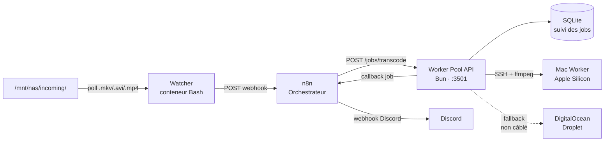

<p align="center">
  <a href="https://github.com/Sofian-bll/media-pipeline/blob/main/LICENSE">
    
  </a>
  <a href="https://github.com/Sofian-bll/media-pipeline/releases">
    
  </a>
  <a href="https://github.com/Sofian-bll/media-pipeline/stargazers">
    
  </a>
</p>

<p align="center">
  
</p>

<h1 align="center" id="readme-top">Media Pipeline</h1>

<p align="center">
  Pipeline de transcodage vidéo automatisée — du dossier NAS à la sortie encodée, avec workers multi-cibles et notifications Discord.
  <br/>
  <br/>
  🇬🇧 <a href="README.md">English</a> · 🇫🇷 <a href="README.fr.md"><b>Français</b></a>
</p>

---

<details open>
<summary>Table des matières</summary>

- [Qu'est-ce que c'est ?](#quest-ce-que-cest-)
- [Architecture](#architecture)
- [Technologies](#technologies)
- [Démarrage rapide](#démarrage-rapide)
- [Utilisation](#utilisation)
- [Structure du projet](#structure-du-projet)
- [État du projet](#état-du-projet)
- [Contribuer](#contribuer)
- [Licence](#licence)

</details>

---

## Qu'est-ce que c'est ?

Media Pipeline surveille un dossier NAS entrant pour détecter de nouveaux fichiers vidéo (MKV, AVI, MP4), orchestre leur transcodage via n8n et distribue les tâches d'encodage à des machines worker — un Mac local en SSH, avec un fallback sur droplet DigitalOcean. Les résultats sont suivis dans une base SQLite et les notifications sont envoyées sur Discord.

**État actuel :** La pipeline cœur est fonctionnelle (watcher → n8n → API → transcodage Mac). Le fallback cloud par droplet et l'intégration du stockage Spaces sont implémentés mais pas encore câblés dans le flux principal. Voir [État du projet](#état-du-projet) pour la roadmap complète.

<p align="right">(<a href="#readme-top">haut de page</a>)</p>

## Architecture



Le flux comporte 4 étapes :

1. **Détecter** — Le Watcher scanne le NAS toutes les 30s, hache les fichiers pour dédupliquer et déclenche un webhook vers n8n quand un nouveau fichier apparaît.
2. **Orchestrer** — n8n reçoit le webhook, transmet la demande de transcodage à l'API Worker Pool et relaie les résultats vers Discord.
3. **Transcoder** — L'API crée un job dans SQLite et le distribue au Mac worker via SSH (ffmpeg x264 + AAC). Si le Mac est injoignable, le job est remis en file d'attente.
4. **Nettoyer** — Un script déclenché par cron supprime les fichiers source de plus de 24h du dossier entrant.

<p align="right">(<a href="#readme-top">haut de page</a>)</p>

## Technologies

- [](https://bun.sh) — Runtime JavaScript
- [](https://www.typescriptlang.org/) — Langage de l'API
- [](https://www.docker.com/) — Conteneurisation
- [](https://n8n.io) — Orchestration des workflows
- [](https://ffmpeg.org/) — Transcodage vidéo
- [](https://www.sqlite.org/) — Persistance des jobs
- [](https://www.gnu.org/software/bash/) — Scripts de supervision
- [](https://www.digitalocean.com/) — Fallback cloud worker

<p align="right">(<a href="#readme-top">haut de page</a>)</p>

## Démarrage rapide

### Prérequis

- Docker et Docker Compose
- Une instance n8n sur le même réseau Docker (`proxy`)
- Un Mac avec ffmpeg accessible en SSH (pour le transcodage local)
- Un token API DigitalOcean (pour le fallback cloud, optionnel)

### 1. Cloner le repo

```bash
git clone https://github.com/Sofian-bll/media-pipeline.git
cd media-pipeline
```

### 2. Configurer l'environnement

```bash
# Copier le fichier d'exemple et remplir vos valeurs
cp .env.example .env
# Éditer .env — définir DISCORD_WEBHOOK et ajuster les chemins si besoin
```

Le Worker Pool lit les secrets depuis `DO_ENV_FILE` (défaut : `/home/sofian/data/secrets/do-api.env`). Créez-le si vous utilisez le fallback cloud DigitalOcean :

```bash
echo "DO_TOKEN=dop_v1_..." > /home/sofian/data/secrets/do-api.env
```

### 3. Configurer la clé SSH pour le Mac worker

```bash
# Placer la clé privée là où le conteneur worker-pool l'attend
cp ~/.ssh/id_ed25519 worker-pool/data/ssh/
chmod 600 worker-pool/data/ssh/id_ed25519
```

### 4. Démarrer les services

```bash
# Une seule commande pour lancer le Watcher et le Worker Pool
docker compose up -d
```

### 5. Importer le workflow n8n

Importez `n8n/n8n-media-pipeline-workflow.json` dans votre instance n8n. Définissez la variable d'environnement `DISCORD_WEBHOOK` dans n8n.

<p align="right">(<a href="#readme-top">haut de page</a>)</p>

## Utilisation

Une fois lancée, la pipeline fonctionne automatiquement :

1. Déposez un fichier `.mkv`, `.avi` ou `.mp4` dans `/mnt/nas/incoming/`.
2. En moins de 30 secondes, le Watcher le détecte et envoie un webhook à n8n.
3. n8n appelle `POST /jobs/transcode` sur l'API Worker Pool.
4. L'API crée un job et lance ffmpeg sur le Mac worker via SSH.
5. Une fois terminé, l'API met à jour le statut du job et n8n envoie une notification Discord.

### Endpoints API

| Méthode | Chemin | Description |
|---------|--------|-------------|
| `GET` | `/health` | Santé de l'API + nombre de jobs |
| `GET` | `/workers/status` | Disponibilité des workers (Mac en ligne/hors ligne) |
| `POST` | `/jobs/transcode` | Créer un nouveau job de transcodage |
| `GET` | `/jobs/:id` | Statut et détails d'un job |

### Exemple : requête de transcodage manuelle

```bash
curl -X POST http://worker-pool.sofian.lab/jobs/transcode \
  -H "Content-Type: application/json" \
  -d '{"file_path": "/mnt/nas/incoming/ma-video.mkv"}'
```

Réponse :

```json
{
  "job_id": "a1b2c3d4-...",
  "status": "queued"
}
```

<p align="right">(<a href="#readme-top">haut de page</a>)</p>

## Structure du projet

```
media-pipeline/
├── docs/
│   └── assets/
│       └── logo.png
├── n8n/
│   └── n8n-media-pipeline-workflow.json   # Workflow orchestrateur n8n
├── scripts/
│   └── cleanup.sh                         # Nettoie les anciens fichiers du dossier entrant
├── docker-compose.yml                     # Compose unifié (les deux services)
├── .env.example                           # Template des variables d'environnement
├── watcher/
│   ├── scripts/
│   │   ├── health.sh                      # Endpoint santé HTTP (port 8080)
│   │   └── watch.sh                       # Boucle de scrutation + envoi webhook
│   ├── Dockerfile
│   └── compose.yml
├── worker-pool/
│   ├── src/
│   │   ├── __tests__/
│   │   │   └── routes/
│   │   │       └── jobs.test.ts
│   │   ├── lib/
│   │   │   ├── db.ts                      # Initialisation et requêtes SQLite
│   │   │   ├── logger.ts                  # Logging JSON structuré
│   │   │   └── notify.ts                  # Notifications webhook Discord
│   │   ├── routes/
│   │   │   └── jobs.ts                    # Handlers HTTP (CRUD + santé)
│   │   ├── services/
│   │   │   ├── cloud-provider.ts          # Wrapper rclone pour DO Spaces
│   │   │   ├── droplet.ts                 # Gestion du cycle de vie des droplets DO
│   │   │   └── mac-worker.ts              # Transcodage SSH + ffmpeg sur Mac
│   │   └── server.ts                      # Point d'entrée Bun.serve
│   ├── Dockerfile
│   ├── compose.yml
│   ├── package.json
│   └── tsconfig.json
├── .gitignore
└── LICENSE
```

<p align="right">(<a href="#readme-top">haut de page</a>)</p>

## État du projet

> **Le projet est en développement actif.** Voici l'état actuel de chaque composant.

### Ce qui fonctionne

| Composant | Statut | Notes |
|-----------|:------:|-------|
| Watcher | ✅ Fini | Scanne le NAS, déduplique par MD5, envoie des webhooks |
| Orchestrateur n8n | ✅ Fini | Reçoit les webhooks, transfère à l'API, envoie les notifs Discord |
| API Worker Pool | ✅ Fini | Serveur Bun sur :3501, CRUD des jobs, persistance SQLite |
| Mac Worker (SSH) | ✅ Fini | Transcodage SSH + ffmpeg avec logique de retry |
| Logique de retry | ✅ Fini | Retry auto si Mac injoignable, échec définitif après 1 retry |
| Script de nettoyage | ✅ Fini | Supprime les fichiers source de plus de 24h |
| Notifications Discord | ✅ Fini | Événements job démarré/terminé/échoué |

### En cours / pas encore câblé

| Composant | Statut | Notes |
|-----------|:------:|-------|
| Fallback droplet cloud | 🔧 Implémenté, non câblé | `droplet.ts` est entièrement codé — création, attente, destruction de droplets DO. Reste à intégrer au flux de dispatch |
| Stockage DO Spaces | 🔧 Implémenté, non câblé | `cloud-provider.ts` enrobe rclone pour upload/check/download. À appeler après la fin du transcodage |
| Callback worker → n8n | 🔧 Implémenté, non câblé | Le workflow n8n a un listener webhook `/worker-callback` prêt. L'API doit POST les résultats de job vers lui |
| Tests | 🔧 Couverture basique | Tests de routes existants. Tests de services (mac-worker, droplet) pas encore écrits |

### Prévu

| Fonctionnalité | Notes |
|----------------|-------|
| Suivi de progression | Stream de la progression ffmpeg vers l'API pour statut en temps réel |
| Estimation des coûts | Suivi des heures droplet DO et estimation du coût par job |
| Multiples Mac workers | Transcodage parallèle sur plusieurs machines locales |
| Dashboard web | File d'attente, statut des workers, historique de transcodage |

<p align="right">(<a href="#readme-top">haut de page</a>)</p>

## Contribuer

Les contributions sont les bienvenues. C'est un projet personnel, mais si vous voulez l'améliorer :

1. Forkez le repo
2. Créez une branche (`git checkout -b feature/super-fonctionnalite`)
3. Committez vos changements (`git commit -m "feat: ajout super fonctionnalité"`)
4. Poussez la branche (`git push origin feature/super-fonctionnalite`)
5. Ouvrez une Pull Request

<p align="right">(<a href="#readme-top">haut de page</a>)</p>

## Licence

Distribué sous licence MIT. Voir [LICENSE](LICENSE) pour plus d'informations.

<p align="right">(<a href="#readme-top">haut de page</a>)</p>

---

<p align="center">
  <a href="https://github.com/Sofian-bll/media-pipeline">
    
  </a>
  <br/>
  <sub>Construit avec Bun, n8n et ffmpeg</sub>
</p>

<!-- REFERENCE_LINKS -->
[bun]: https://bun.sh
[typescript]: https://www.typescriptlang.org/
[docker]: https://www.docker.com/
[n8n]: https://n8n.io
[ffmpeg]: https://ffmpeg.org/
[sqlite]: https://www.sqlite.org/
[bash]: https://www.gnu.org/software/bash/
[digitalocean]: https://www.digitalocean.com/
