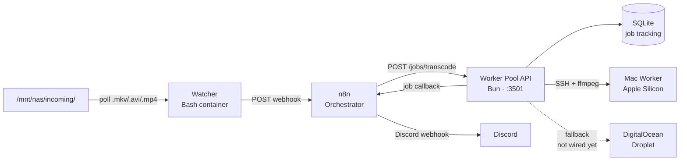

<p align="center">
  <a href="https://github.com/Sofian-bll/media-pipeline/blob/main/LICENSE">
    
  </a>
  <a href="https://github.com/Sofian-bll/media-pipeline/releases">
    
  </a>
  <a href="https://github.com/Sofian-bll/media-pipeline/stargazers">
    
  </a>
</p>

<p align="center">
  
</p>

<h1 align="center" id="readme-top">Media Pipeline</h1>

<p align="center">
  Automated video transcoding pipeline — from NAS folder to encoded output with multi-target workers and Discord notifications.
  <br/>
  <br/>
  🇬🇧 <a href="README.md"><b>English</b></a> · 🇫🇷 <a href="README.fr.md">Français</a>
</p>

---

<details open>
<summary>Table of Contents</summary>

- [What is this?](#what-is-this)
- [Architecture](#architecture)
- [Built With](#built-with)
- [Quick Start](#quick-start)
- [Usage](#usage)
- [Project Structure](#project-structure)
- [Project Status](#project-status)
- [Contributing](#contributing)
- [License](#license)

</details>

---

## What is this?

Media Pipeline watches a NAS incoming folder for new video files (MKV, AVI, MP4), orchestrates their transcoding through n8n, and dispatches encoding jobs to worker machines — a local Mac over SSH, with a DigitalOcean droplet fallback. Results are tracked in a SQLite job database and notifications are sent to Discord.

**Current state:** Core pipeline is functional (watcher → n8n → API → Mac transcoding). Cloud droplet fallback and Spaces storage integration are implemented but not yet wired into the main job flow. See [Project Status](#project-status) for the full roadmap.

<p align="right">(<a href="#readme-top">back to top</a>)</p>

## Architecture



The flow has 4 stages:

1. **Detect** — Watcher polls the NAS every 30s, hashes files to deduplicate, and fires a webhook to n8n when a new file appears.
2. **Orchestrate** — n8n receives the webhook, forwards the transcode request to the Worker Pool API, and relays job results to Discord.
3. **Transcode** — The API creates a job in SQLite and dispatches it to the Mac worker via SSH (ffmpeg x264 + AAC). If the Mac is unreachable, the job is retried.
4. **Clean up** — A cron-triggered script prunes source files older than 24 hours from the incoming folder.

<p align="right">(<a href="#readme-top">back to top</a>)</p>

## Built With

- [](https://bun.sh) — JavaScript runtime
- [](https://www.typescriptlang.org/) — API language
- [](https://www.docker.com/) — Container runtime
- [](https://n8n.io) — Workflow orchestration
- [](https://ffmpeg.org/) — Video transcoding
- [](https://www.sqlite.org/) — Job persistence
- [](https://www.gnu.org/software/bash/) — Watcher & utility scripts
- [](https://www.digitalocean.com/) — Cloud worker fallback

<p align="right">(<a href="#readme-top">back to top</a>)</p>

## Quick Start

### Prerequisites

- Docker and Docker Compose
- n8n instance on the same Docker network (`proxy`)
- A Mac with ffmpeg accessible via SSH (for local transcoding)
- DigitalOcean API token (for cloud fallback, optional)

### 1. Clone the repo

```bash
git clone https://github.com/Sofian-bll/media-pipeline.git
cd media-pipeline
```

### 2. Configure environment

```bash
# Create secrets file for DO API
echo "DO_TOKEN=dop_v1_..." > /home/sofian/data/secrets/do-api.env
```

The Worker Pool reads from `/home/sofian/data/secrets/do-api.env`. Adjust the path in `worker-pool/compose.yml` if needed.

### 3. Set up SSH key for Mac worker

```bash
# Place your private key where the worker-pool container expects it
cp ~/.ssh/id_ed25519 worker-pool/data/ssh/
chmod 600 worker-pool/data/ssh/id_ed25519
```

### 4. Start the services

```bash
# Watcher (polls NAS for new files)
docker compose -f watcher/compose.yml up -d

# Worker Pool API (manages transcode jobs)
docker compose -f worker-pool/compose.yml up -d
```

### 5. Import the n8n workflow

Import `n8n/n8n-media-pipeline-workflow.json` into your n8n instance. Set the `DISCORD_WEBHOOK` environment variable in n8n.

<p align="right">(<a href="#readme-top">back to top</a>)</p>

## Usage

Once running, the pipeline works automatically:

1. Drop a `.mkv`, `.avi`, or `.mp4` file into `/mnt/nas/incoming/`.
2. Within 30 seconds, the Watcher detects it and sends a webhook to n8n.
3. n8n calls `POST /jobs/transcode` on the Worker Pool API.
4. The API creates a job and dispatches ffmpeg to the Mac worker via SSH.
5. On completion, the API updates the job status and n8n sends a Discord notification.

### API Endpoints

| Method | Path | Description |
|--------|------|-------------|
| `GET` | `/health` | API health check + job count |
| `GET` | `/workers/status` | Worker availability (Mac online/offline) |
| `POST` | `/jobs/transcode` | Create a new transcode job |
| `GET` | `/jobs/:id` | Get job status and details |

### Example: manual transcode request

```bash
curl -X POST http://worker-pool.sofian.lab/jobs/transcode \
  -H "Content-Type: application/json" \
  -d '{"file_path": "/mnt/nas/incoming/my-video.mkv"}'
```

Response:

```json
{
  "job_id": "a1b2c3d4-...",
  "status": "queued"
}
```

<p align="right">(<a href="#readme-top">back to top</a>)</p>

## Project Structure

```
media-pipeline/
├── docs/
│   └── assets/
│       └── logo.png
├── n8n/
│   └── n8n-media-pipeline-workflow.json   # n8n orchestrator workflow
├── scripts/
│   └── cleanup.sh                         # Prunes old files from incoming dir
├── watcher/
│   ├── scripts/
│   │   ├── health.sh                      # HTTP health endpoint (port 8080)
│   │   └── watch.sh                       # Poll loop + webhook sender
│   ├── Dockerfile
│   └── compose.yml
├── worker-pool/
│   ├── src/
│   │   ├── __tests__/
│   │   │   └── routes/
│   │   │       └── jobs.test.ts
│   │   ├── lib/
│   │   │   ├── db.ts                      # SQLite init + queries
│   │   │   ├── logger.ts                  # Structured JSON logging
│   │   │   └── notify.ts                  # Discord webhook notifications
│   │   ├── routes/
│   │   │   └── jobs.ts                    # HTTP handlers (CRUD + health)
│   │   ├── services/
│   │   │   ├── cloud-provider.ts          # rclone wrapper for DO Spaces
│   │   │   ├── droplet.ts                 # DO droplet lifecycle management
│   │   │   └── mac-worker.ts              # SSH + ffmpeg transcode on Mac
│   │   └── server.ts                      # Bun.serve entrypoint
│   ├── Dockerfile
│   ├── compose.yml
│   ├── package.json
│   └── tsconfig.json
├── .gitignore
└── LICENSE
```

<p align="right">(<a href="#readme-top">back to top</a>)</p>

## Project Status

> **The project is under active development.** Below is the current state of each component.

### What's working

| Component | Status | Notes |
|-----------|:------:|-------|
| Watcher | ✅ Done | Polls NAS, deduplicates via MD5, fires webhooks |
| n8n Orchestrator | ✅ Done | Receives watcher webhooks, forwards to API, sends Discord notifs |
| Worker Pool API | ✅ Done | Bun server on :3501, job CRUD, SQLite persistence |
| Mac Worker (SSH) | ✅ Done | SSH + ffmpeg transcoding with retry logic |
| Job retry logic | ✅ Done | Auto-retries on Mac unreachable, permanent fail after 1 retry |
| Cleanup script | ✅ Done | Prunes source files older than 24h |
| Discord notifications | ✅ Done | Job started/completed/failed events |

### In progress / not yet wired

| Component | Status | Notes |
|-----------|:------:|-------|
| Cloud droplet fallback | 🔧 Implemented, not wired | `droplet.ts` is fully coded — create, poll, destroy DO droplets. Needs integration into the job dispatch flow |
| DO Spaces storage | 🔧 Implemented, not wired | `cloud-provider.ts` wraps rclone for upload/check/download. Needs to be called after transcode completion |
| Worker callback to n8n | 🔧 Implemented, not wired | The n8n workflow has a `/worker-callback` webhook listener ready. The API needs to POST job results back to it |
| Tests | 🔧 Basic coverage | Route-level tests exist. Service-level tests (mac-worker, droplet) not yet written |

### Planned

| Feature | Notes |
|---------|-------|
| Progress tracking | Stream ffmpeg progress to the API for real-time status |
| Cost estimation | Track DO droplet hours and estimate cost per job |
| Multiple Mac workers | Parallel transcoding across several local machines |
| Web UI dashboard | Job queue, worker status, transcode history |

<p align="right">(<a href="#readme-top">back to top</a>)</p>

## Contributing

Contributions are welcome. This is a personal project, but if you'd like to improve it:

1. Fork the repo
2. Create a feature branch (`git checkout -b feature/amazing-feature`)
3. Commit your changes (`git commit -m "feat: add amazing feature"`)
4. Push to the branch (`git push origin feature/amazing-feature`)
5. Open a Pull Request

<p align="right">(<a href="#readme-top">back to top</a>)</p>

## License

Distributed under the MIT License. See [LICENSE](LICENSE) for more information.

<p align="right">(<a href="#readme-top">back to top</a>)</p>

---

<p align="center">
  <a href="https://github.com/Sofian-bll/media-pipeline">
    
  </a>
  <br/>
  <sub>Built with Bun, n8n, and ffmpeg</sub>
</p>

<!-- REFERENCE_LINKS -->
[bun]: https://bun.sh
[typescript]: https://www.typescriptlang.org/
[docker]: https://www.docker.com/
[n8n]: https://n8n.io
[ffmpeg]: https://ffmpeg.org/
[sqlite]: https://www.sqlite.org/
[bash]: https://www.gnu.org/software/bash/
[digitalocean]: https://www.digitalocean.com/
